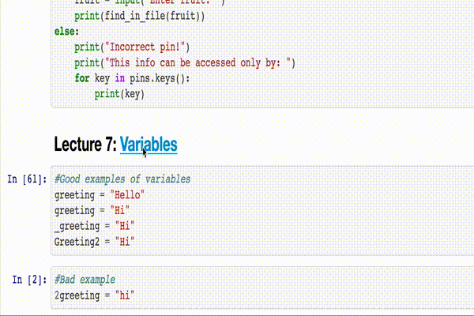

# What are these?

This repository contains all the source code of The Python Mega Course, a comprehensive Python course authored by Ardit Sulce. 

If you're not a member of the course, you can become one for just a one-time payment of $15 using the discount link below: [https://www.udemy.com/the-python-mega-course/?couponCode=GITREADSECTION](https://www.udemy.com/the-python-mega-course/?couponCode=GITREADSECTION)

If you're not a member you can still use these Jupyter notebooks, but you won't be able to see the video lectures and you won't be able to ask questions to the instructor inside the course.

### How to use these notebooks?

There's one notebook for each section of the coures. Simply click the notebook you want, locate the lecture, and copy the code. Or if you know how to use Jupyter notebooks, then use the green download button further above to download all the notebooks and open them in your browser.

Clicking a lecture opens the corresponding video lecture on Udemy:

### What are the prerequisites to use these?

To be able to run the Python code shown in these notebooks you should have Python 3 installed in your computer. If the code uses a third party library that is mentioned in the notebooks.

### Author
Ardit Sulce
